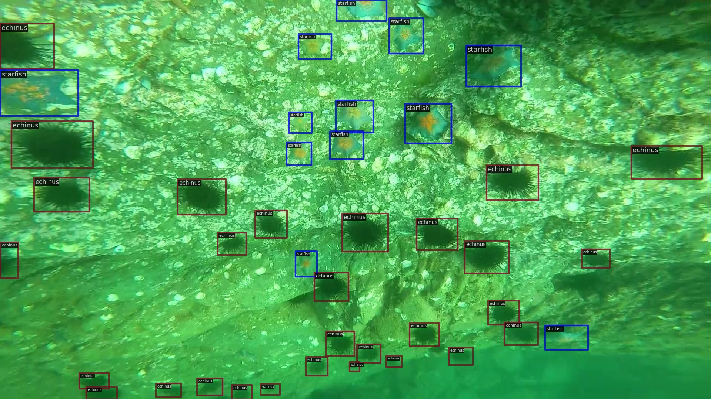

# Dynamic YOLO for Small Underwater Object Detection

Underwater object detection is one of the most essential methods for marine exploration. However, small objects in underwater environments pose a crucial challenge that degrades detection performance dramatically. In this paper, a dynamic YOLO detector is presented as a solution to alleviate this problem. First, a light-weight backbone network is built based on deformable convolution v3 with some specialized designs for small object detection. Second, a unified feature fusion framework based on channel-, scale-, and spatial-aware attention is proposed to fuse feature maps from different scales. It can fully utilize the increased capability of the proposed backbone. Lastly, a simple but effective detection head is designed to deal with the conflict between classification and localization by disentangling and aligning the two tasks. With the alignment, our dynamic YOLO obtains the ability for robust localization. Extensive experiments are conducted on benchmark datasets to demonstrate the effectiveness of the proposed model. Without bells and whistles, dynamic YOLO outperforms the recent state-of-the-art methods by a large margin of $+1.2 \ mAP$, and $+1.8 \ AP_{S}$ on $\textit{DUO}$ dataset. Experimental results on $\textit{Pascal VOC}$ and $\textit{MS COCO}$ detasets also demonstrate the superiority of the proposed method. At last, ablation studies on $\textit{DUO}$ dataset are conducted to validate the effectiveness and efficiency of each design. 



## Usage

Our detection code is developed on top of [MMDetection v3.0](https://github.com/open-mmlab/mmdetection/tree/3.x).

### Install

- Clone this repo:

```bash
git clone https://github.com/chenjie04/Dynamic-YOLO.git
cd Dynamic-YOLO
```

- Create a conda virtual environment and activate it:

```bash
conda create -n Dynamic-YOLO python=3.8 -y
conda activate Dynamic-YOLO
```

- Install PyTorch following official instructions, e.g.

```bash 
conda install pytorch==2.0.0 torchvision==0.15.0 torchaudio==2.0.0 pytorch-cuda=11.8 -c pytorch -c nvidia
```

- Install MMEngine, MMCV and mmdet using MIM.

```bash
pip install -U openmim
mim install mmengine
mim install "mmcv>=2.0.0"
mim install mmdet
```

- Install and configre wandb:

```bash
pip install wandb
wandb login
```
Provide [your API key](https://wandb.ai/authorize) when prompted.

- Install other requirements:

```bash
pip install timm # For stochastic depth
pip install ninja # For the compilation of DCN v3 
```
- Compile DCN v3 CUDA operators:

```bash
cd ./ops_dcnv3
sh ./make.sh
# unit test (should see all checking is True)
python test.py
```

### Data Preparation

Download Detecting Underwater Objects ([DUO](https://github.com/chongweiliu/DUO)). It is recommended to download and extract the dataset somewhere outside the project directory. The folder structure is like follow:

```bash
|--data
|    |--coco
|    |--DUO
|    |--VOCdevkit
|
|--Dynamic-YOLO
|    |--config
|    .....
```

### Training

- Multi-gpu training

```bash
bash dist_train.sh configs/dynamic_yolo/dynamic_yolo_s_300e_DUO.py 2
```

- Single-gpu Training

```bash
python train.py configs/dynamic_yolo/dynamic_yolo_s_300e_DUO.py
```

### Testing

```bash
python test.py configs/dynamic_yolo/dynamic_yolo_s_300e_DUO.py ork_dirs/dynamic_yolo_s_300e_DUO/epoch_300.pth
```